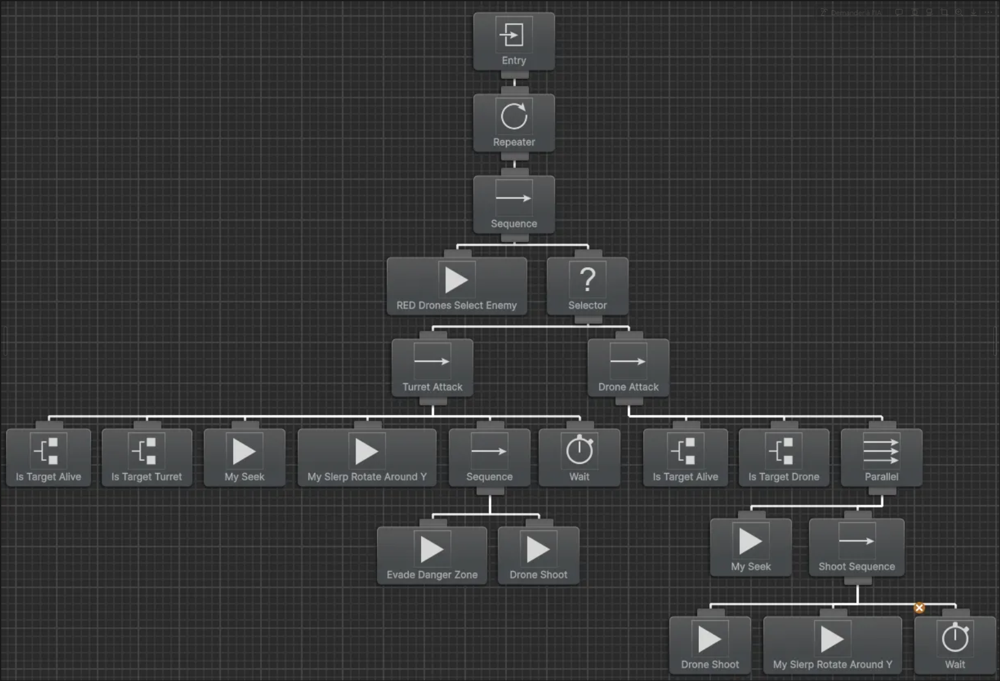

# Projet-JV-EPF-5A

## Description du Projet

Ce projet est une simulation de combat stratégique mettant en scène deux armées de robots : une armée rouge et une armée verte. L'armée rouge est en infériorité numérique face à l'armée verte, et l'objectif principal du projet est d'améliorer le comportement de l'intelligence artificielle de l'armée rouge afin de lui permettre de surmonter cet désavantage numérique et de remporter la victoire, sans modifier les statistiques des unités.

## Comment Lancer la Simulation

Pour lancer la simulation :

1. Ouvrez le projet dans Unity.
2. Naviguez vers le dossier `Assets/Scenes/` et ouvrez l'unique scène présente.
3. Lancez la simulation en cliquant sur le bouton 'Play' dans l'éditeur Unity.

## Conditions de Victoire

La partie est gagnée lorsque tous les robots de l'armée adverse ont été détruits.

## Intelligence Artificielle

L'IA des unités est gérée à l'aide de Behavior Designer, un système d'arbres de comportement pour Unity. Ces arbres de comportement définissent la logique de décision et les actions des drones et tourelles sur le champ de bataille.

**Exemple d'Arbre de Comportement pour les Drones Rouges :**

L'image ci-dessus montre la structure d'un arbre de comportement typique, illustrant comment les unités prennent des décisions, choisissent leurs cibles (e.g., `RED Drones Select Enemy`), et exécutent des actions comme l'attaque (`Turret Attack`, `Drone Attack`), le mouvement (`My Seek`), et le tir (`Drone Shoot`). Le défi réside dans l'optimisation de cette logique pour permettre à l'armée rouge de déjouer son adversaire supérieur en nombre.
